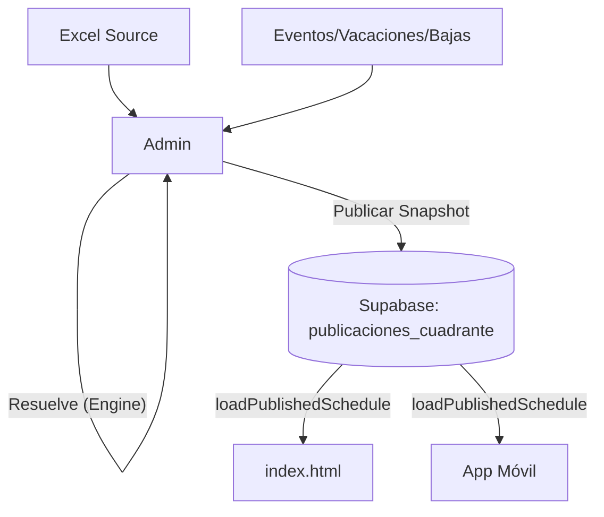

# Arquitectura de TurnosWeb — Reglas de Integridad

## Regla Crítica: Admin Resuelve, Público Consume

Este proyecto sigue un patrón de **Snapshot Final** para garantizar que las vistas de consumo (Escritorio público y App Móvil) sean siempre consistentes y no dependan de cálculos en tiempo real que puedan divergir de lo que ve Administración.

### 1. Responsabilidades

#### **Administración (Admin Dashboard)**
- **Única Fuente de Verdad Operativa**: Es el único módulo que tiene permitido resolver la operativa completa.
- **Motor de Resolución**: Utiliza `TurnosEngine` y `ShiftResolver` para cruzar:
    - Turnos Base (desde Excel)
    - Vacaciones
    - Bajas y Permisos
    - Sustituciones
    - Cambios de Turno (Peticiones aprobadas)
- **Publicación**: Al "Publicar en Supabase", Administración genera un **Snapshot Estático** (un objeto JSON horneado) y lo guarda en la tabla `publicaciones_cuadrante`.

#### **Vistas de Consumo (index.html / App Móvil)**
- **Solo Lectura**: Solo tienen permitido leer snapshots ya publicados.
- **Renderizado Estático**: Pintan exactamente lo que el snapshot contiene.
- **Prohibiciones**:
    - NO recalcular turnos.
    - NO consultar `eventos_cuadrante` para reconstruir lógica.
    - NO decidir sustituciones.
    - NO usar `resolveEmployeeDay` para lógica operativa.
    - NO alterar el orden de los empleados.

### 2. Flujo de Datos

### 3. Implementación Técnica

- **Tabla**: `publicaciones_cuadrante` (hotel_id, semana_inicio, snapshot_json).
- **Función de Carga**: `window.TurnosDB.loadPublishedSchedule(startDate, endDate)`.
- **Guardrail**: `const CONSUMER_VIEW_MODE = 'READ_ONLY_PUBLISHED_SNAPSHOT';` presente en todas las vistas de consumo.

---
*Cualquier cambio en la lógica de resolución de turnos debe realizarse exclusivamente en el motor central (`shift-resolver.js` / `turnos-engine.js`) y ser validado desde el panel de Administración antes de publicarse.*
